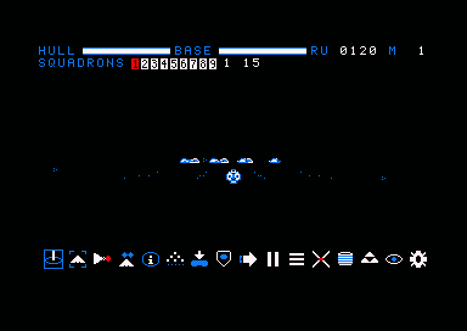
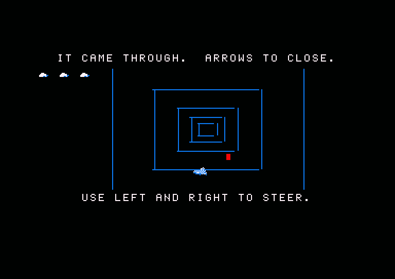
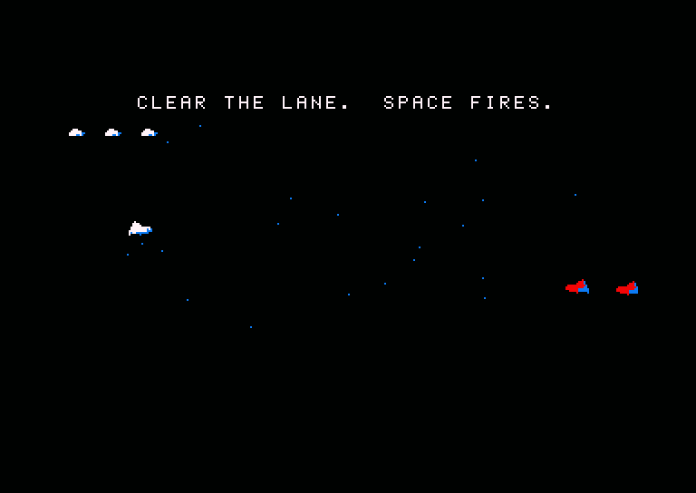

# HOMEPLANET — Player's Manual

*A fleet-strategy game for the Amstrad CPC 6128. Revive8bit, 2026.*

---

## 1. The story

Nine generations ago a world was lost. What was saved of it sleeps in the
hold of a single Mothership: sixty thousand people, and the fleet that
guards them.

You command that fleet across twenty jumps to a planet that is only a
name — HOMEPLANET. The Vekhar hold the lanes between here and there, and
they will come at you at every stop. The fleet only ever shrinks. A ship
that is lost is lost; a ship that is damaged stays damaged unless you spend
what little you have to mend it. Every mission is a decision about how much
of the fleet you are willing to spend to reach the next one.

**Lose the Mothership and the journey is over.** Bring it down on the last
world and the sleepers wake.

## 2. Getting started

### What is on the disc

| file | what it is |
|---|---|
| `RUN"DISC` | **the game** |
| `RUN"MINI` | the vortex chase minigame on its own, in a loop, for practice |
| `RUN"MINI2` | the R-Type run minigame on its own, in a loop |
| `RUN"HOME` | the splash screen |
| `RUN"MUSIC3` | the game's music, on its own |

The game keeps one saved campaign on the disc. It is written every time
you jump, so the power going off between missions costs you nothing; it is
erased when you lose the Mothership, or when you land. Starting a new
campaign with `SPACE` does not touch it until your first jump writes over
it, so a `SPACE` pressed by habit can be undone by switching off.

### The title screen

`RUN"DISC` loads the game and shows the title: the name, the planet, a
flight of ships, the tune, and `SPACE - NEW GAME`.

| key | what it does |
|---|---|
| `SPACE` | begin a **new** campaign |
| `C` | **continue** the saved one. The key is only offered — and only works — when the disc holds a campaign |
| `T` | the tutorial: eighteen short lessons, one key at a time |
| `M` | music on / off. It remembers, and the game's own music obeys it too |

### The tutorial

`T` on the title screen puts you on a practice stage with a small fleet
and one enemy. Every step waits for you to actually do the thing it asks
— look, select, move, build, fight, fly, salvage — so it cannot be skipped
through, but it can be *left*: `ESC` at any step takes you back to the
title. Nothing you do on the stage touches your saved campaign.

### Mission briefings

Every mission opens on a briefing: its name, three lines about where you
are and what is expected, and `ENTER` to begin. Read the last line. When a
mission has no enemy waiting, it tells you what will come instead.

## 3. The screen

The playfield is the middle of the screen, between two strips of
instruments.

### The context bar (top)

One line that always tells you **what the keys do right now**. Keys are
in blue, what they do in white, and a word in red is a state that wants
your attention.

| the bar reads | you are |
|---|---|
| `ESC MENU ENTER MOVE B BUILD A ATTACK` | playing |
| `PAUSED  SPACE RESUME ESC MENU` | paused |
| `ARROWS MOVE SHIFT HEIGHT ENTER OK ESC` | placing the move disc |
| `INTERCEPTOR 035 RU , . PICK ENTER BUY` | in the build panel |
| `RECYCLE? Y CONFIRM ESC CANCEL` | about to scrap a squadron |
| `JUMPING 09 ESC CANCEL` | ten seconds from leaving |
| `LANDING 09 ESC CANCEL` | ten seconds from home |
| `ARROWS FLY SPACE FIRE V BACK` | flying a ship yourself |
| `ESC LEAVE SPACE PAUSE ? KEYS` | in the tutorial |

When a key changes its meaning — `,` and `.` step through targets in the
game and through the price list in the build panel — the bar is where you
find out.

### The HUD (bottom)

Three rows.

- **`HULL nnn%`** — how battered the fleet you still have is, all of its
  hull summed against what those same ships would have undamaged. It turns
  red below a third. Beside it, the **message row**: `INCOMING` when a
  wave arrives, `YARD: FRIGATE` / `YARD: DESTROYER` when the yard learns a
  new class, `AUTO RESPONSE ON` / `USED`. At the far end, **`BASE nnn%`**,
  the Mothership's own hull, which is the one number that must not reach
  zero.
- **Row A** — your squadrons and how many ships each has. The selected one
  is white, the rest blue. Then `RU nnnn`, the treasury, and `?HELP`.
- **Row B** — more squadrons; the yard's readout (`>INT 3` is an
  interceptor on the slipway with three more waiting); `M nn`, the mission
  number; and **`JUMP`** in red when you may leave, or **`LAND`** on the
  last mission.

### The four inks

The palette means something and the game never breaks the rule:

| ink | means |
|---|---|
| white | your ships, text, what you have chosen |
| blue | scenery, chrome, the reference plane, the keys on the bar |
| red | the enemy, explosions, alarms, and the one thing that wants pressing |
| black | space |

### What you are looking at

The world is three-dimensional. A grid of blue dots marks the reference
plane; your ships fly above and below it. The camera orbits whatever you
have selected — the squadron where it is right now, not where it was
told to go — from a distance you choose with the zoom. Ships are drawn at
three sizes depending on how far away they are; further away than that a
ship is a **dot** in its side's colour — white for yours, red for theirs —
still exactly where it is. When many sit on top of each other at a wide
zoom they are drawn as one ship with a **`+n`** beside it: that many ships
there.

If the Mothership is off the screen, a blue marker on the edge of the view
points the way to it; the bar hanging from it says how far above or below
you it sits.

Resource fields are three-pixel clusters. **Blue** means there is ore in
it; **white** means it is nearly mined out and the harvesters should be
sent somewhere else.

## 4. The camera

| key | what it does |
|---|---|
| cursor keys | orbit around the selection |
| `Z` / `X` (or `+` / `-`) | zoom in / out, twelve steps |
| `P` | pan: the cursor keys drag the view sideways instead of orbiting. `0` clears the pan |
| `TAB` or `S` | the sensor view: every ship as a dot or a cross, the battle at triple speed. For the long transits |
| `0` | centre on the Mothership (and select it) |
| `SPACE` | **tactical pause**. The battle freezes; you can still look around and give orders |

The four widest zoom steps show more of the world at the same size of ship
— distant stacks consolidate into `+n` counts there. The four **nearest**
steps go the other way: the three nearest ships are drawn twice, three
times and four times their size, the same way the cockpit draws them. Two steps out from
where a mission opens, a big fleet is already a field of dots, and that is
deliberate: dots are cheap to draw, and a fleet of fifty is what slows the
game down. Zoom in on the part you are giving orders to.

## 5. Squadrons

Your fleet is organised in up to nine squadrons, numbered `1` to `9`. A
squadron is anything with ships in it; an empty number does not exist. The
starting fleet is all squadron 1.

| key | what it does |
|---|---|
| `1` – `9` | select that squadron |
| `0` | select the **Mothership** — every squadron is deselected |
| `D` | **divide** the selected squadron in half; the new half takes the next free number |
| `L` | move one ship to the next number, creating it if need be |
| `K` | move one ship to the previous number |
| `C` | **combine** the selection with the next active squadron |
| `O` | **one squadron per class**, across the whole fleet: interceptors become 1, harvesters 3, scouts 4, bombers 5, frigates 6, corvettes 7, destroyers 8. Press it again three missions later and the numbers are the same |
| `I` | the **squadron page**: what the selection is made of, by class, with each class's hull. `ESC` goes back |
| `F` | cycle the squadron's **formation**: Loose → Wedge → Sphere → Wall |

`O` is the one to learn. The balance of this game is between classes, so
"send the bombers at the frigate" needs the bombers to be a squadron first.

A new squadron is born where its ships are: divide a formation and the two
halves stay together until you send one of them somewhere.

## 6. Orders

Orders go to the **selected squadron**. The Mothership is not a squadron:
it holds station, and the orders that tell a squadron where to *be* do not
apply to it.

### Moving

| key | what it does |
|---|---|
| `ENTER` | open the **move disc**: a cursor on the reference plane with a line down to it. Cursor keys slide it; `SHIFT` + up/down raise and lower it. `ENTER` again sends the squadron there; `ESC` cancels |
| `R` | **station** the squadron on the Mothership |
| `F` | change formation, see above |

Disc movement is relative to the camera: "right" is right on the screen.

A movement order ends an attack order. If a squadron is fighting and you
want it home, `R` or the disc brings it.

### Fighting

| key | what it does |
|---|---|
| `,` / `.` | step the **target** through the enemy ships. The camera does not move; the choice shows on the ships' orders when you press `A` |
| `A` | **attack**. The squadron closes on its target — or on the nearest enemy, if you chose none — and stays on it until nothing is left to shoot at. Then it comes home by itself |
| `G` | **guard**: hold station and shoot whatever comes within range |
| `W` | **strafing run**: the armed ships close, fire for a few volleys of contact — **each hitting twice as hard** as an attack's — and come home by themselves. Hit and withdraw. Harvesters and corvettes in the squadron keep their own work |
| `V` | **fly a ship yourself** — see section 7 |

A squadron that holds formation is spread wider than its guns reach. In a
fight, `A` is nearly always the better order.

**The auto response.** Out of a fight, `A` does something else: it *arms*
the squadron's response, and the message row says `AUTO RESPONSE ON`. The
first time an enemy then lands a hit on any ship of any squadron, every
idle ship in that squadron turns on the shooter at once — as if you had
pressed `A` with that target the same instant. It works once a mission;
after it has fired, `A` out of a fight says `AUTO RESPONSE USED`. Every
mission starts with it off. In a fight, `A` is the attack order it always
was.

### Working

| key | what it does |
|---|---|
| `H` | send the selection's **harvesters** to the fields. They fill a hold, fly it back to the Mothership, and go again until the field is empty |
| `T` | send the selection's **salvage corvettes** to **tow** wrecks home. Each corvette picks its own hull |
| `E` | **repair** the selection: every ship it can afford is mended whole, at twice the price of the damage. Once a mission, and not with an enemy flying. With the Mothership selected (`0`), `E` instead mends the base at one per cent a second while the yard stands still — press again to stop |
| `Y` | **recycle** the selection for RU — half its price rising to seven tenths for an undamaged hull. `Y` asks again before it does it |
| `B` | the **build panel** — see section 8 |

### Everything else

| key | what it does |
|---|---|
| `ESC` | the **orders menu**: every command with its key beside it. Cursor keys pick, `ENTER` runs it. While the disc, the panel, a recycle question or a jump countdown is open, `ESC` cancels *that* instead |
| `?` | the **key list** |
| `J` | **jump** — see section 10 |
| `M` | music on / off |

## 7. Flying a ship yourself

Press `V` with a squadron selected and its lead ship is yours. The camera
drops **inside the cockpit**, looking along the nose; the rest of the
squadron goes on doing what it was told.

| key | while flying |
|---|---|
| ← / → | turn |
| ↑ / ↓ | climb / dive |
| `SPACE` | fire — one shot per press, and the gun's own cooldown holds between them |
| `V` | hand the ship back to its squadron. It goes back by itself when the fight ends |

The ship always flies forward, a third faster than the autopilot. Its gun
is the ship's own: it hits whatever enemy is nearest within range, and does
the damage that class does. You cannot pause while flying — `SPACE` is the
trigger — so hand the ship back first.

**Ramming.** Fly into an enemy and both of you pay your hull: the enemy
takes as much damage as your ship had left, and your ship is gone. A fresh
interceptor into a frigate is a real trade; a shot-up one is a poor
missile. Wrecks cannot be rammed.

A **reticle** marks the middle of the view; it turns **red** while a flying
enemy is inside it, and white again when there is none. A red reticle is a
**lock**: your gun aims at that enemy, and once you are within about
fifteen hundred units of it your ship **matches its motion** — it moves as
the enemy moves, so you neither overtake it nor lose it, and it stays where
it is in your view for as long as you keep your nose on it. Further away
than that you still fly forward to close. Turn away, or let it leave the
reticle, or kill it, and you are flying on your own again the same frame.
The three nearest ships are
drawn as ships, and the nearest of those larger than anywhere else in the
game — twice the size inside about four thousand units, three times inside
three, four times inside two; everything else is a mark like the sensor view's, a dot for a fighter
and a cross for anything bigger, which is what keeps the cockpit quick in a
fight. Nothing behind your nose
is drawn, and nothing closer than about five thousand units ahead of it —
the cockpit sees the middle distance. The **scanner** at the bottom right
is for the rest: an oval, which is the plane you fly in seen flat, with
you as the white dot in its middle and every flying enemy a red mark
placed relative to your heading — up the oval is ahead of you, right is
right, five hundred units to the pixel across and a thousand up. A mark
level with you is a dash on the plane; one above or below you stands on a
**stalk** rising or falling from its point on the plane, the bar at the
tip being where it is — as in Elite. A mark touching your dot is an enemy
in gun range.

Your ship's own shots leave from the middle of the view and **fly**: a
short white streak crosses from the reticle to the enemy over a few
frames, following it if it moves. The damage lands when the gun fires; the
streak is what it looked like. Its death, a jump,
`V` again, or **the end of the fight** puts the camera back on the squadron:
once something hostile has been flying while you fly and nothing is any
more, the ship rejoins its squadron by itself. On a board with nothing to
fight, `V` stays with you. The Mothership cannot be flown, and the tutorial's
ships cannot either.

## 8. The economy

Everything costs **RU** — resource units — and RU comes from exactly one
place: ore mined by harvesters and carried back to the Mothership. You
start with 120.

### Harvesting

Every mission has two to four resource fields. Send the selection's
harvesters to them with `H`; they mine, fly home, unload, and go back until
the field is empty. A harvester is slow and unarmed, and the Vekhar know
it: an escort near a harvester takes the shot instead about half the time,
and a harvester alone takes all of them.

A field that has run dry disappears from the screen.

### The build panel

`B` opens the panel; the bar shows the class, its price, and whether
`ENTER` will work. `,` and `.` walk the list, cheapest first. `ENTER`
orders one. `ESC` closes the panel. The yard builds one ship at a time and
takes a **queue of ten**; RU is spent when the order is placed. A ship
joins the squadron that ordered it.

| class | RU | hull | role |
|---|---|---|---|
| Scout | 25 | 160 | fast and made of paper |
| Interceptor | 35 | 255 | the fighter. Good against bombers, poor against frigates |
| Harvester | 40 | 200 | mines. Unarmed; needs escort |
| Bomber | 55 | 255 | slow, and murderous against frigates and the Mothership |
| Salvage Corvette | 90 | 220 | tows wrecks home for their full price. Lightly armed |
| Frigate | 120 | 255 | a wall. Shreds fighters; bombers shred it |
| Destroyer | 250 | 255 | the capital ship |

A class that cannot be ordered yet is not shown. **With no harvester
flying or on the way, only a harvester can be built**, so the campaign
cannot lock itself out of income.

The **Frigate** and the **Destroyer** are not on the list until you have
towed one of their hulls home. A dead Vekhar frigate drifts at the edge of
missions 4 to 6, a destroyer in missions 9 to 11; a corvette and `T` bring
it in, the message row says `YARD: FRIGATE`, and from then on the yard can
build it.

`FLEET FULL` means there is no slot left for another ship; `QUEUE FULL`
means wait and press `ENTER` again.

### Wrecks and salvage

When an enemy ship is destroyed and fewer than four hulls are adrift, it
leaves a **wreck** instead of nothing. A wreck is inert — it cannot shoot,
it cannot be shot, it does not count as an enemy — and a Salvage Corvette
under `T` will fetch it. Delivered to the Mothership, it pays that class's
full price.

**A wreck may fight back.** The moment a corvette gets a line on a hull,
about half the time one Vekhar comes out of it, `INCOMING` goes up and a
red cross marks the wreck. The corvette needs cover for exactly that
moment.

### Repair and recycling

Repair costs twice the price of the damage. At half damage, mending and
building cost the same; below that, mend, above it, let the ship die and
build another. Recycling pays half the price for a hulk rising to seven
tenths for an undamaged ship. Together they say: mend a scratch, scrap a
hulk — and repair is only the cheaper choice below about a sixth of
damage.

## 9. Combat

### How ships fight

Every class moves at the same speed and shoots at the same range, once
every few seconds. What differs is the **damage each class does to each
other**, and that is the whole balance of the game:

- **Interceptor → Bomber → Frigate → Interceptor.** On the game's scale an
  interceptor does 24 to another interceptor, 30 to a bomber and *ten* to a
  frigate; a bomber does 8 to a fighter and 44 to a Mothership; a frigate
  does 40 to a fighter. Every shot lands an **eighth** of that against a
  hull of up to 255, so a fight is a matter of minutes rather than seconds
  and a single ship can turn one.
- A capital ship is hard to kill not because its hull is bigger — a hull
  is 255 at most and an interceptor already has that — but because most
  classes do so little to it.

The Vekhar field interceptors, bombers and frigates, and from the middle
of the campaign they mix them. Read the shapes: a wall of frigates cannot
be out-traded by fighters, and bombers behind a screen of fighters are
going for the base.

Shots are visible: three dots flash between the shooter and its target, in
the shooter's colour.

### The Mothership

It is the base, the yard, and the thing the campaign is about. It does not
move. It has a gun with **twice the reach** of anything else, so a fleet
stationed on it fights inside its cover — and a wave coming for it is shot
at long before it shoots back. Its hull is `BASE nnn%`; mend it with `0`
then `E`.

### Attack waves

Stay in a mission for a minute and the Vekhar start arriving in **waves**:
random size, every one to two minutes, from one bearing, on a shell around
the Mothership. They never stop. `INCOMING` on the message row and a **red
cross** where they are arriving tell you which way to turn.

A wave is sized against the fleet you still have — a sixteenth to a quarter
of its summed hull, plus one — so a battered fleet faces smaller waves. It
is not a way to farm: three waves cost a whole fleet ten to fifteen per cent
of its hull, permanently.

Waves do not count towards a mission's objective, but they do count against
leaving: you cannot jump with a wave still flying.

### What you cannot do

You cannot repair under fire, or twice in a mission. You cannot leave with
an enemy flying. You cannot build without a harvester. You cannot fly the
Mothership.

## 10. The campaign

Twenty missions. Each has a name, a picket of enemies (or none), resource
fields, and an **objective**:

| objective | met when |
|---|---|
| CLEAR | the mission's own enemy is dead |
| ARRIVE | at once — you have arrived |
| SURVIVE | you are still there |

| # | mission | # | mission |
|---|---|---|---|
| 1 | The Test | 11 | Kera |
| 2 | Ash | 12 | The Shoals |
| 3 | The Wreck | 13 | The Foundry |
| 4 | The Depot | 14 | The Drift |
| 5 | The Nebula | 15 | The Anvil |
| 6 | The Graves | 16 | The Cross |
| 7 | The Gate | 17 | The Watch |
| 8 | The Dark | 18 | Threshold |
| 9 | Cold Iron | 19 | Last Gate |
| 10 | The Relay | 20 | Homeplanet |

### Leaving

`JUMP` appears on the HUD when all five of these hold:

1. the objective is met;
2. **three waves** have come and gone;
3. **nothing hostile is flying** — wrecks do not count;
4. you can pay the **fare**: 200 RU for the first jump, rising to 2500 by
   the eighteenth. The last two are free;
5. you hold at least **1000 RU** — the fare comes out of it, and what is
   left is what you rebuild with. The landing waives this too.

Then `J`. The drive spools for **ten seconds** of live battle — the bar
counts them down — and `ESC` calls it off. A wave landing during the spool
cancels it by itself. When the count reaches zero the fleet is swept away,
the campaign is saved to disc, and the next briefing opens.

A mission is a siege: clear what is there, hold the ground through three
waves, and go.

### What travels

Every ship's position, class, hull, squadron and order. Damage is
permanent. The build queue and the half-built hull on the slipway travel
too. Wrecks, and the enemy, do not.

### Landing

On the twentieth mission the key reads **`LAND`**, and both `J` and `L`
land. Landing is free. The Mothership sets down on the planet, and the
sleepers wake.

### Losing

Lose the Mothership and it is over: the game says so, the saved campaign
is erased, and `SPACE` begins again from the first mission.

## 11. Between the jumps

Twice in every four jumps, something happens in the lane.

### The vortex chase (jumps into missions 5, 9, 13, 17)

One Vekhar has run ahead through the vortex. You are behind it, in a
tunnel of rings. **Left and right** steer; hold the enemy in front of you
and the distance closes; let it slip and it grows. When it is far it fires
torpedoes back down the shaft at you — dodge them. Three hits and you are
lost.

Close the distance and the Vekhar is **captured**. Fail, and the fleet
comes out of the jump into an ambush that costs ships — the further away
it was, the more.

### The run (jumps into missions 3, 7, 11, 15, 19)

A picket waits at the jump point and one interceptor goes ahead to clear
it. The lane scrolls right to left; **up and down** fly, **`SPACE`** fires.
Flights of three come at you on curving paths and fire back. Every kill is
salvage, paid in RU when the run ends. Three hits and you are shot down —
and the fleet pays for the lane you did not clear.

Near the end a **destroyer** comes in, holds in the middle of the lane and
fires twice as often. It takes nine hits. The run does not end until it is
dead, or you are.

The first time each happens, a page explains it and `ENTER` begins. Your
three lives are shown as three small ships at the top left, taken away one
by one.

`RUN"MINI` and `RUN"MINI2` play the two on their own, in a loop, with a
fresh fleet each round and no campaign at stake.

## 12. All the keys

| key | in the game |
|---|---|
| `1`–`9` | select squadron |
| `0` | select the Mothership, centre on it, clear the pan |
| cursor keys | orbit / move the disc / pan / fly |
| `Z` `X` `+` `-` | zoom |
| `P` | pan on / off |
| `TAB` `S` | sensor view |
| `SPACE` | pause (fire, while flying; a new campaign, on the title) |
| `C` | combine squadrons (continue the saved campaign, on the title) |
| `ENTER` | move disc open / confirm; buy, in the panel; dismiss a briefing |
| `ESC` | menu; or cancel the disc, the panel, a recycle, a jump; leave the tutorial |
| `SHIFT` + ↑↓ | raise / lower the disc |
| `F` | formation |
| `D` `K` `L` `C` `O` | divide, ship back, ship on, combine, split by class |
| `I` | squadron page |
| `,` `.` | target (or pick a class, in the panel) |
| `A` | attack / arm the auto response |
| `G` | guard |
| `W` | strafing run |
| `V` | fly the lead ship / hand it back |
| `H` | harvest |
| `T` | tow wrecks |
| `E` | repair (the base, with `0` selected) |
| `Y` | recycle |
| `B` | build panel |
| `R` | station on the Mothership |
| `J` | jump (land, on the last mission) |
| `L` | also lands, on the last mission with `LAND` on offer |
| `?` | key list |
| `M` | music |

## 13. Advice from the lane

- **Buy a harvester before anything else.** The first jump costs more than
  you start with.
- **Keep the fleet on the Mothership** between fights. It is where the
  waves come, and its gun reaches further than yours.
- **Press `O`** and learn what your numbers are. The game is fought by
  class.
- **`A` beats formation.** A squadron holding station is wider than its
  guns.
- **Arm the auto response** with `A` before a wave lands, then get on with
  the harvesting. The squadron that is hit will answer for you.
- **Bombers for frigates, interceptors for bombers.** Ten damage against a
  frigate is not a fight, it is a subscription.
- **Tow every wreck.** A corvette pays for itself in two hulls, and the
  Frigate and Destroyer are behind two of them.
- **Do not repair before the fight.** You get one, and it will not work
  under fire.
- **The fare climbs.** Build in the first half of the campaign; pay to
  travel in the second.
- **Fly a ship** when the fight is small and the Mothership is not at
  stake. Ram when it is.

---

*Homeplanet is written in Z80 assembly for the Amstrad CPC 6128 by
Revive8bit / Vasper, 2026. The full design and every decision behind it are
in the repository's own documents.*
